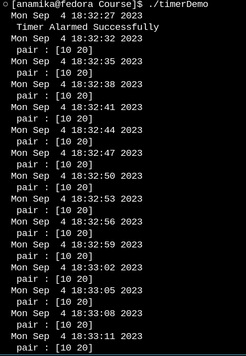

# LinuxPosixTimerTutorial
A comprehensive guide to working with Linux Posix Timers. It includes code samples, tutorials, and best practices for utilizing Posix Timers in a Linux environment. Whether you're a beginner looking to understand timer fundamentals or an expert seeking advanced techniques, this repo aims to be a one-stop resource

---

# POSIX Timers: An In-Depth Guide and Library 📝

## Introduction 🌟

Welcome to this project, focused on understanding and implementing **POSIX Timers** on Unix-based systems like Linux. This is more of a conceptual guide, but all demonstrations and source code are designed for Linux. Fork this repository to get your hands on the code samples. 

---

## Pre-requisites 📚

Before diving in, ensure you have:

- Linux Operating System (either native or in a VM).
- Basic familiarity with callback function pointers.
- C programming environment for following the code samples.

---

## Objectives 🎯

By the end of this project, you'll be proficient in:

1. **Creating, updating, and deleting** Linux timers.
2. **Pausing, resuming, or rescheduling** timers at will.
3. Implementing various types of timers: **periodic, one-shot, and exponential backoff timers**.
4. Crafting **timer-based applications** and algorithms.
5. Building your **custom Timer Library** as a capstone mini-project.

---

## Why Timers Matter ⏱

Timers are ubiquitous in computer science, particularly in:

- **Networking protocols**: Think OTP timeouts, session expiration, periodic packet dispatch.
- **Real-world applications**: Your mobile OTP has a timer, inactive web sessions expire due to timers, and so on.

---

## Custom Timer Library 🛠

This project culminates in a robust Timer Library, designed to give you full control over:

- Starting Timers 🚀
- Pausing Timers ⏸
- Resuming Timers ▶️
- Killing Timers ❌
- Rescheduling Timers 🔄

---

Feel free to clone, star, or fork this repository. Contributions and pull requests are more than welcome!

Good luck with your journey into the world of POSIX timers! 🍀

## Sample output 

--- 
